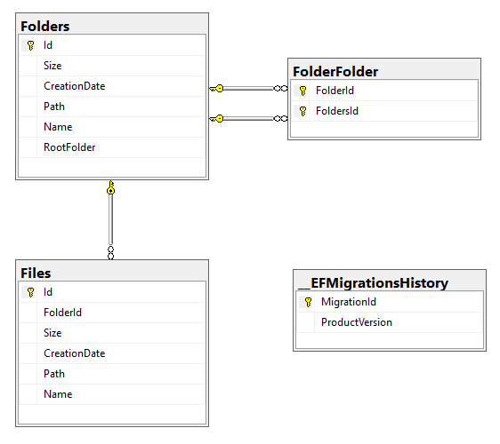
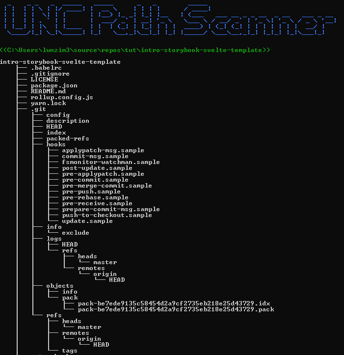

# Documentation
## Motive
This Tool is made to scan UNC Paths recursively with the following requested features:
1. Scan UNC Paths (Files and Folders) and save the result to the database.
1. display the Top Month with the most and biggest files created in that month.
1. display a bar diagram of the top 10 folders with the biggest sizes.
1. display Tree Structure of the folder.
---

> Please Note That this document is not a full documentation of the project but snippets from different parts of the project because the time is not enough.

---

## Access Layer
### Diagram

### Models Notes
- It's worth noticing that a because a folder has folders inside it, it will have to reference itself.
this explains the extra FolderFolder table.

- Folders has a rootFolder Field which means only the scanned paths by the user will be marked as RootFolder to simplify the view.
---

## Logic
### Path Scanning 
To scan the paths I used a Recursive function that register all files and folders.
### Top Month (most + biggest files)
Achieved by searching through all folders and registering the needed information and counting the files depending on the month.
> Note: I didn't register the year, because the question is not clear if the month depend on the year or not.
Therefore I didn't implement the year but it should be an easy task by adding the year to the `UNCMonthDetails.cs` class and making sure to register the year when searching through the folders.

> Note2: the month name is german, i didn't have time to change the `CultureInfo` to receive the English name instead.

### Top 10 Biggest Folders Bar Diagram
Achieved by Sorting only the top level folders after size.
> Note: I didn't took subFolders with the rootLevel folders because all subFolders will have less or same size as it's parent folder.

### Folder Tree structure
Achieved by printing the files and folders recursively.

---
## User Interface
I used the C# Console application to display the tool as it is easier to use and setup than a Graphical interface.

To add a beautiful style to the console and make it as interactive as possible without having to spend a lot of time implementing such mechanisms, I Used `Spectre Console`.
`Spectre.Console` is an easy to use console library which supports required features like: 
1. `Selection Menu` => so the user can choose from a menu instead of having to write the same word to choose a menu option.
1. `Status (Spinner)` => indicate loading of data.
1. `Text Prompt` => Input of a path to scan
1. `Tree` => To display Tree view
1. `Bar Chart` => To display Bar diagram
1. `Markdown` => To easily change style and color of the text.

> Note: I could use Commands to handle the selection menu instead of handling numbers, but creating commands needs more time. (which I don't have)
## user Tests
### Scan Path
#### Errors Testing 21.02.2023-14:20
1. Entering Invalid Path like: `test` which will result in a message pointing the user to enter a valid Path.
1. Not existing Path like: `C:\Users\xxx\source\repos\UNCPath\invisible` which doesn't exist will result in a message pointing the user to enter a valid Path.
#### Success Testing 21.02.2023-14:23
The scan will succeeded when the path is correct. a loading spinner will be displayed and the folders / files will be saved to the database.
### Getting a Path Top Month
#### Success Testing 21.02.2023-14:26
Received Message: Top Month (size + files created): January
### Getting The Bar Diagram
#### Success Testing 21.02.2023-14:29

### Getting the Tree structure
#### Success Testing 21.02.2023-14:39

---
Mahmoud Zino